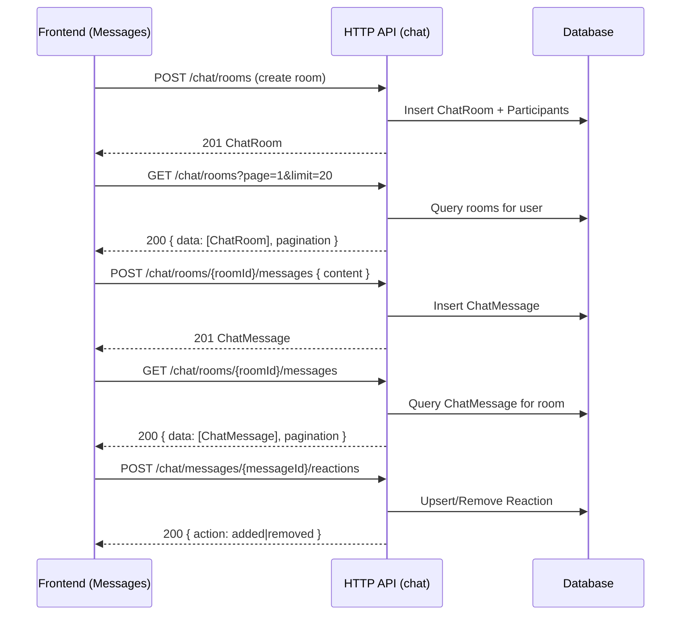

### Chat API – HTTP Endpoints for Messages Module

This document lists all HTTP endpoints under the `chat` module used by the Messages feature. It includes methods, paths, descriptions, authentication, request/response schemas, example payloads, curl examples, and a typical end‑to‑end workflow.

—

## Base URLs and Auth

- **Base URL (prod)**: `https://api.unlimtedhealth.com/api`
- **Base URL (local)**: `http://localhost:3000/api`
- **Global prefix**: All routes are prefixed with `/api` (set via `app.setGlobalPrefix('api')`).
- **Auth**: All endpoints below require JWT Bearer auth.
  - Header: `Authorization: Bearer <ACCESS_TOKEN>`

—

## Entities (response shape reference)

The service returns persisted objects based on these entities:
- `ChatRoom`: `{ id, name, type, isActive, appointmentId, centerId, createdBy, maxParticipants, isEncrypted, autoDeleteAfterDays, roomSettings, createdAt, updatedAt, participants?, messages? }`
- `ChatParticipant`: `{ id, roomId, userId, role, joinedAt, leftAt, isActive, permissions, participantSettings }`
- `ChatMessage`: `{ id, roomId, senderId, messageType, content, fileUrl, fileName, fileSize, fileType, replyToMessageId, isEdited, editedAt, isDeleted, deletedAt, deliveryStatus, metadata, createdAt, reactions? }`

—

## Endpoints

All paths below are relative to the base URL (e.g., `GET /chat` means `GET https://api.unlimtedhealth.com/api/chat`).

### 1) GET /chat
- **Description**: Simple readiness/info endpoint for the Chat HTTP surface; confirms the WebSocket namespace.
- **Auth**: Required
- **Request**: none
- **Response 200 (example)**:
```json
{
  "message": "Chat WebSocket gateway is available",
  "userId": "2f5c7b3e-3c2a-4c26-9b9d-2ecf2f1d9a2a",
  "timestamp": "2025-10-07T12:34:56.789Z",
  "websocketNamespace": "/chat"
}
```

### 2) POST /chat/rooms
- **Description**: Create a new chat room and add initial participants.
- **Auth**: Required
- **Body (CreateChatRoomDto)**:
```json
{
  "name": "Consultation Room",
  "type": "consultation", // one of: direct, group, consultation, emergency, support
  "appointmentId": "a1b2c3d4-e5f6-4a7b-8c9d-0123456789ab",
  "centerId": "7b4d1d78-1f41-4a32-a7b6-e13c5e1b1234",
  "maxParticipants": 10,
  "isEncrypted": true,
  "autoDeleteAfterDays": 90,
  "roomSettings": { "allowFileShare": true },
  "participantIds": [
    "11111111-1111-1111-1111-111111111111",
    "22222222-2222-2222-2222-222222222222"
  ]
}
```
- **Response 201 (example)**: `ChatRoom` with `participants` and (empty) `messages` arrays.

### 3) GET /chat/rooms?page={page}&limit={limit}
- **Description**: List chat rooms for the current user with pagination.
- **Auth**: Required
- **Query**: `page` (number, default 1), `limit` (number, default 20)
- **Response 200 (example)**:
```json
{
  "data": [
    {
      "id": "a9cd1a61-2d1b-4f27-b9d3-2a7c4e8d0f1a",
      "name": "Consultation Room",
      "type": "consultation",
      "isActive": true,
      "createdBy": "99999999-9999-9999-9999-999999999999",
      "updatedAt": "2025-10-07T12:40:00.000Z",
      "participants": [ { "userId": "...", "role": "admin" } ]
    }
  ],
  "total": 1,
  "page": 1,
  "totalPages": 1
}
```

### 4) GET /chat/rooms/{roomId}/messages?page={page}&limit={limit}
- **Description**: Get messages for a room (chronological order). Requires membership in the room.
- **Auth**: Required
- **Params**: `roomId` (UUID)
- **Query**: `page` (number, default 1), `limit` (number, default 50)
- **Response 200 (example)**:
```json
{
  "data": [
    {
      "id": "e8b0b8c1-0d2a-4de3-8a0c-6c4e4a2b3c1d",
      "roomId": "a9cd1a61-2d1b-4f27-b9d3-2a7c4e8d0f1a",
      "senderId": "11111111-1111-1111-1111-111111111111",
      "messageType": "text",
      "content": "Hello, how are you feeling today?",
      "deliveryStatus": "sent",
      "metadata": {},
      "createdAt": "2025-10-07T12:41:00.000Z",
      "reactions": []
    }
  ],
  "total": 1,
  "page": 1,
  "totalPages": 1
}
```

### 5) POST /chat/rooms/{roomId}/messages
- **Description**: Send a message to the given room. Requires `can_send_messages` permission.
- **Auth**: Required
- **Params**: `roomId` (UUID)
- **Body (SendMessageDto)**:
```json
{
  "content": "Hello, how are you feeling today?",
  "messageType": "text", // optional: text, file, image, video, audio, system, video_call_start, video_call_end
  "fileUrl": null,
  "fileName": null,
  "fileSize": null,
  "fileType": null,
  "replyToMessageId": null,
  "messageMetadata": { "triage": false }
}
```
- **Response 201 (example)**: `ChatMessage` object with assigned `id` and timestamps.

### 6) POST /chat/messages/{messageId}/reactions
- **Description**: Toggle a reaction on a message. If the same reaction exists, it is removed; otherwise it is added.
- **Auth**: Required
- **Params**: `messageId` (UUID)
- **Body**:
```json
{ "reaction": ":thumbsup:" }
```
- **Response 200 (example)**:
```json
{ "action": "added", "reaction": { "id": "...", "messageId": "...", "userId": "...", "reaction": ":thumbsup:", "createdAt": "..." } }
```
or
```json
{ "action": "removed" }
```

### 7) PATCH /chat/messages/{messageId}
- **Description**: Edit the content of a message that you authored.
- **Auth**: Required
- **Params**: `messageId` (UUID)
- **Body**:
```json
{ "content": "Updated content" }
```
- **Response 200**: Updated `ChatMessage` with `isEdited: true` and `editedAt` set.

### 8) DELETE /chat/messages/{messageId}
- **Description**: Soft-delete a message (content set to "[Message deleted]"). Allowed for author or room admin.
- **Auth**: Required
- **Params**: `messageId` (UUID)
- **Response 200 (example)**:
```json
{ "success": true }
```

### 9) POST /chat/rooms/{roomId}/participants
- **Description**: Add a participant to the room (admin only).
- **Auth**: Required
- **Params**: `roomId` (UUID)
- **Body**:
```json
{ "userId": "33333333-3333-3333-3333-333333333333" }
```
- **Response 201**: Created `ChatParticipant`.

### 10) DELETE /chat/rooms/{roomId}/participants/{participantId}
- **Description**: Remove a participant from the room. Admins can remove others; any user can remove themselves.
- **Auth**: Required
- **Params**: `roomId` (UUID), `participantId` (UUID of the participant record)
- **Response 200 (example)**:
```json
{ "success": true }
```

—

## Typical Workflow



—

## curl Testing Examples

Set your environment first:
```bash
BASE="https://api.unlimtedhealth.com/api"
TOKEN="<YOUR_ACCESS_TOKEN>"
AUTH_HEADER="Authorization: Bearer ${TOKEN}"
JSON="Content-Type: application/json"
```

1) Create room
```bash
curl -sS -X POST "$BASE/chat/rooms" \
  -H "$AUTH_HEADER" -H "$JSON" \
  -d '{
        "name": "Consultation Room",
        "type": "consultation",
        "participantIds": [
          "11111111-1111-1111-1111-111111111111",
          "22222222-2222-2222-2222-222222222222"
        ]
      }'
```

2) List my rooms
```bash
curl -sS -H "$AUTH_HEADER" "$BASE/chat/rooms?page=1&limit=20"
```

3) Send a message
```bash
ROOM_ID="<ROOM_UUID>"
curl -sS -X POST "$BASE/chat/rooms/$ROOM_ID/messages" \
  -H "$AUTH_HEADER" -H "$JSON" \
  -d '{
        "content": "Hello, how are you feeling today?",
        "messageType": "text",
        "messageMetadata": {"triage": false}
      }'
```

4) Get messages
```bash
curl -sS -H "$AUTH_HEADER" "$BASE/chat/rooms/$ROOM_ID/messages?page=1&limit=50"
```

5) React to a message (toggle)
```bash
MESSAGE_ID="<MESSAGE_UUID>"
curl -sS -X POST "$BASE/chat/messages/$MESSAGE_ID/reactions" \
  -H "$AUTH_HEADER" -H "$JSON" \
  -d '{"reaction": ":thumbsup:"}'
```

6) Edit a message
```bash
curl -sS -X PATCH "$BASE/chat/messages/$MESSAGE_ID" \
  -H "$AUTH_HEADER" -H "$JSON" \
  -d '{"content": "Updated content"}'
```

7) Delete a message
```bash
curl -sS -X DELETE "$BASE/chat/messages/$MESSAGE_ID" -H "$AUTH_HEADER"
```

8) Add a participant (admin)
```bash
curl -sS -X POST "$BASE/chat/rooms/$ROOM_ID/participants" \
  -H "$AUTH_HEADER" -H "$JSON" \
  -d '{"userId": "33333333-3333-3333-3333-333333333333"}'
```

9) Remove a participant
```bash
PARTICIPANT_ID="<PARTICIPANT_UUID>"
curl -sS -X DELETE "$BASE/chat/rooms/$ROOM_ID/participants/$PARTICIPANT_ID" -H "$AUTH_HEADER"
```

—

## Validation and Error Responses

The API uses `class-validator` and a global validation pipe. Common errors:

- 400 Bad Request – Validation failed (array of messages)
```json
{ "statusCode": 400, "message": ["participantIds must be an array of UUIDs"], "error": "Bad Request" }
```
- 401 Unauthorized – Missing/invalid JWT
- 403 Forbidden – Not a participant, insufficient permissions, or not a room admin
- 404 Not Found – Message/room/participant not found
- 429 Too Many Requests – If rate limits are enforced by the gateway/proxy
- 500 Internal Server Error – Unexpected errors

—

## Notes for Frontend Integration

- Use the base URL above; production is `https://api.unlimtedhealth.com/api`.
- All endpoints require the `Authorization` header with a valid JWT.
- The WebSocket namespace for realtime updates is `/chat`; HTTP endpoints above are complementary for data fetching and actions.


