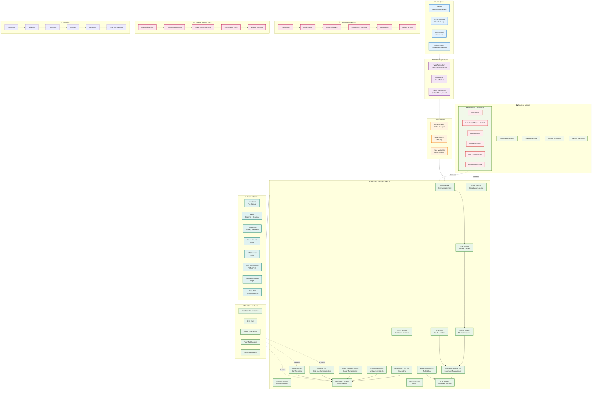

# System Architecture & User Interaction Diagram

## 🏗️ **Healthcare System Architecture - User Interaction View**

This diagram shows the system architecture and how different user types interact with the backend services.



## 🔄 **System Interaction Patterns**

### **1. User Authentication Flow**
```
User Input → API Gateway → Authentication Service → JWT Token → 
Role Assignment → Service Access Control
```

### **2. Data Processing Flow**
```
User Request → Validation → Service Processing → Database → 
Cache Update → Real-time Notification → User Response
```

### **3. Real-time Communication Flow**
```
User Action → WebSocket → Service Update → Database → 
Cache Invalidation → Push Notification → Real-time UI Update
```

### **4. Security & Compliance Flow**
```
User Request → JWT Validation → Role Check → Service Access → 
Audit Logging → Data Encryption → Secure Response
```

## 🎯 **Key Architecture Features**

### **1. Microservices Architecture**
- **Service Independence**: Each service handles specific domain
- **Scalable Design**: Services can scale independently
- **Technology Flexibility**: Different services can use different tech stacks

### **2. Real-time Capabilities**
- **WebSocket Support**: Live chat and video conferencing
- **Push Notifications**: Instant updates across devices
- **Live Data Sync**: Real-time database updates

### **3. Security & Compliance**
- **JWT Authentication**: Secure token-based authentication
- **Role-Based Access**: Granular permissions for different user types
- **Audit Logging**: Complete activity tracking for compliance
- **Data Encryption**: Secure storage and transmission

### **4. Performance & Scalability**
- **Redis Caching**: Fast data access and session management
- **Database Optimization**: PostgreSQL with TypeORM
- **CDN Integration**: Supabase for file storage and delivery
- **Load Balancing**: API gateway with rate limiting

## 🚀 **Deployment Architecture**

### **Production Environment**
- **Domain**: `api.unlimtedhealth.com`
- **SSL**: HTTPS with valid certificates
- **Load Balancer**: Nginx configuration
- **Database**: PostgreSQL with connection pooling
- **Cache**: Redis cluster for high availability
- **Storage**: Supabase with CDN

### **Staging Environment**
- **Development**: Local development setup
- **Testing**: Automated testing pipeline
- **CI/CD**: Continuous integration and deployment
- **Monitoring**: Health checks and performance metrics

## 📊 **System Performance Metrics**

### **Response Times**
- **API Endpoints**: < 200ms average response time
- **Database Queries**: < 100ms for simple queries
- **File Uploads**: < 2s for 10MB files
- **Real-time Updates**: < 50ms for WebSocket messages

### **Scalability Targets**
- **Concurrent Users**: 10,000+ simultaneous users
- **API Requests**: 100,000+ requests per minute
- **File Storage**: 1TB+ medical document storage
- **Database**: 100GB+ patient data storage

---

**This architecture diagram shows how the healthcare system is built with scalability, security, and real-time capabilities in mind, supporting the complex user journeys while maintaining performance and compliance.**
