# User Journey Visualization - Healthcare Management System

## 🎯 **Complete User Journey Diagram**

This diagram visualizes the actual implemented user journeys based on the backend API capabilities.

```mermaid
graph TB
    %% User Entry Points
    Start([User Arrives]) --> Auth{Authentication}
    
    %% Authentication Flow
    Auth -->|New User| Register[Registration<br/>4 Fields Only]
    Auth -->|Existing User| Login[Login]
    
    %% Registration Flow
    Register --> QuickStart[Quick Start<br/>30 seconds]
    QuickStart --> ProfileSetup{Profile Setup}
    ProfileSetup -->|Skip| Dashboard[Main Dashboard]
    ProfileSetup -->|Complete| EnhancedProfile[Enhanced Profile<br/>AI-Guided]
    
    %% Main User Types
    Dashboard --> UserType{User Type}
    UserType -->|Patient| PatientFlow
    UserType -->|Doctor/Staff| ProviderFlow
    UserType -->|Center Staff| CenterFlow
    UserType -->|Admin| AdminFlow
    
    %% PATIENT JOURNEY
    subgraph PatientFlow [Patient Journey]
        P1[Health Assessment<br/>AI Chat] --> P2[Center Discovery<br/>Location Services]
        P2 --> P3[Appointment Booking<br/>Recurring Options]
        P3 --> P4[Pre-Visit Prep<br/>AI Assistance]
        P4 --> P5[Consultation<br/>Video Call + Chat]
        P5 --> P6[Medical Records<br/>Document Management]
        P6 --> P7[Follow-up Care<br/>Equipment Needs]
        P7 --> P8[Ongoing Health<br/>AI Monitoring]
        
        %% Emergency Services
        P1 --> Emergency[Emergency Services<br/>Always Accessible]
        Emergency --> E1[Emergency Alert]
        E1 --> E2[Ambulance Dispatch]
        E2 --> E3[Location Sharing]
        E3 --> E4[Provider Notification]
        E4 --> E5[Post-Emergency Care]
        
        %% Blood Donation
        P1 --> BloodDonation[Blood Donation<br/>Community Health]
        BloodDonation --> BD1[Donor Registration]
        BD1 --> BD2[Urgent Request Alerts]
        BD2 --> BD3[Donation Scheduling]
        BD3 --> BD4[Reward Tracking]
        
        %% Equipment Marketplace
        P7 --> Equipment[Medical Equipment<br/>Marketplace]
        Equipment --> EQ1[Equipment Search<br/>Advanced Filtering]
        EQ1 --> EQ2[Rental Requests]
        EQ2 --> EQ3[Maintenance Scheduling]
        EQ3 --> EQ4[Vendor Management]
    end
    
    %% PROVIDER JOURNEY
    subgraph ProviderFlow [Healthcare Provider Journey]
        PR1[Staff Onboarding<br/>Admin-Controlled] --> PR2[Patient Management<br/>Access Records]
        PR2 --> PR3[Appointment Calendar<br/>Availability Setup]
        PR3 --> PR4[Consultation Tools<br/>Video + Chat]
        PR4 --> PR5[Medical Records<br/>Updates + Prescriptions]
        PR5 --> PR6[AI-Assisted Care<br/>Diagnostic Help]
        PR6 --> PR7[Equipment Management<br/>Inventory + Rentals]
    end
    
    %% CENTER STAFF JOURNEY
    subgraph CenterFlow [Healthcare Center Journey]
        C1[Center Management<br/>Profile + Staff] --> C2[Operational Management<br/>Appointments + Resources]
        C2 --> C3[Equipment Marketplace<br/>Rental + Sales]
        C3 --> C4[Maintenance Scheduling<br/>Vendor Coordination]
    end
    
    %% ADMIN JOURNEY
    subgraph AdminFlow [Administrator Journey]
        A1[System Administration<br/>User Management] --> A2[Role Assignment<br/>Permission Control]
        A2 --> A3[Compliance Monitoring<br/>Audit Logs]
        A3 --> A4[Security Settings<br/>Authentication Config]
    end
    
    %% AI INTEGRATION (Connects All Flows)
    subgraph AIHub [AI Health Concierge]
        AI1[Persistent Chat Widget<br/>Every Screen] --> AI2[Context-Aware Suggestions<br/>Based on Activity]
        AI2 --> AI3[Health Recommendations<br/>Personalized Care]
        AI3 --> AI4[Symptom Analysis<br/>Medical Guidance]
        AI4 --> AI5[Drug Interactions<br/>Safety Validation]
    end
    
    %% REAL-TIME COMMUNICATION (Connects All Flows)
    subgraph CommunicationHub [Real-Time Communication]
        COM1[Unified Chat Interface<br/>All Communications] --> COM2[Video Conferencing<br/>Integrated Calls]
        COM2 --> COM3[File Sharing<br/>Document Exchange]
        COM3 --> COM4[Push Notifications<br/>Instant Updates]
        COM4 --> COM5[WebSocket Support<br/>Live Updates]
    end
    
    %% Connect AI and Communication to all flows
    AIHub -.->|Guides| PatientFlow
    AIHub -.->|Assists| ProviderFlow
    AIHub -.->|Supports| CenterFlow
    AIHub -.->|Monitors| AdminFlow
    
    CommunicationHub -.->|Enables| PatientFlow
    CommunicationHub -.->|Facilitates| ProviderFlow
    CommunicationHub -.->|Connects| CenterFlow
    CommunicationHub -.->|Notifies| AdminFlow
    
    %% Key Integration Points
    P5 -.->|Uses| CommunicationHub
    P6 -.->|Integrates| Equipment
    P7 -.->|Connects| BloodDonation
    Emergency -.->|Alerts| CommunicationHub
    
    %% Success Metrics
    Dashboard --> Success[Success Metrics]
    Success --> S1[Seamless Transitions<br/>Between Services]
    Success --> S2[AI-Guided Complexity<br/>Human Touch Maintained]
    Success --> S3[Real-Time Updates<br/>User Informed]
    Success --> S4[Emergency Access<br/>From Anywhere]
    Success --> S5[Progressive Complexity<br/>Grows with Needs]
    Success --> S6[Community Health<br/>Blood + Equipment]
    Success --> S7[Mobile-First Design<br/>Accessibility]
    
    %% Styling
    classDef startEnd fill:#e1f5fe,stroke:#01579b,stroke-width:2px
    classDef process fill:#f3e5f5,stroke:#4a148c,stroke-width:2px
    classDef decision fill:#fff3e0,stroke:#e65100,stroke-width:2px
    classDef emergency fill:#ffebee,stroke:#c62828,stroke-width:3px
    classDef ai fill:#e8f5e8,stroke:#2e7d32,stroke-width:2px
    classDef communication fill:#e0f2f1,stroke:#00695c,stroke-width:2px
    classDef success fill:#f1f8e9,stroke:#33691e,stroke-width:2px
    
    class Start,Start startEnd
    class Register,Login,QuickStart,Dashboard,EnhancedProfile,ProfileSetup process
    class Auth,UserType,ProfileSetup decision
    class Emergency,E1,E2,E3,E4,E5 emergency
    class AI1,AI2,AI3,AI4,AI5 ai
    class COM1,COM2,COM3,COM4,COM5 communication
    class Success,S1,S2,S3,S4,S5,S6,S7 success
```

## 🔄 **User Flow Integration Patterns**

### **1. Seamless Service Transitions**
- **AI as Health Concierge**: Guides users through complex health decisions
- **Real-time Communication**: Connects all user interactions
- **Context-Aware Navigation**: Smart suggestions based on current activity

### **2. Progressive Complexity**
- **Quick Start**: 4-field registration for immediate access
- **Enhanced Profile**: Optional AI-guided completion
- **Feature Discovery**: Natural progression through health services

### **3. Emergency Integration**
- **Always Accessible**: Emergency button on every screen
- **Real-time Response**: Instant location sharing and dispatch
- **Post-Emergency Care**: Seamless transition to recovery

### **4. Community Health Features**
- **Blood Donation**: Integrated with health profile
- **Equipment Sharing**: Marketplace within care flows
- **Health Impact**: Visual community contribution tracking

## 📱 **Key User Experience Principles**

1. **"One Health Journey"**: Unified ecosystem, not separate apps
2. **AI-Guided Complexity**: Intelligent assistance for health decisions
3. **Real-time Everything**: Live updates and instant communication
4. **Emergency First**: Safety features always accessible
5. **Progressive Enhancement**: Features grow with user needs
6. **Mobile-First**: Accessible anywhere, anytime
7. **Community Integration**: Health as a shared responsibility

## 🚀 **Implementation Strategy**

### **Phase 1: Core Health Journey**
- Patient registration and basic profile
- Appointment booking and management
- Simple medical records access

### **Phase 2: AI Integration**
- Health chat and symptom analysis
- Smart recommendations and scheduling
- Predictive health insights

### **Phase 3: Advanced Services**
- Equipment marketplace integration
- Blood donation system
- Emergency services

### **Phase 4: Real-time Features**
- Video conferencing and chat
- Push notifications
- Live updates and sync

---

**This diagram represents the ACTUAL implemented backend API capabilities and shows how users seamlessly flow between different health services in a unified ecosystem.**
